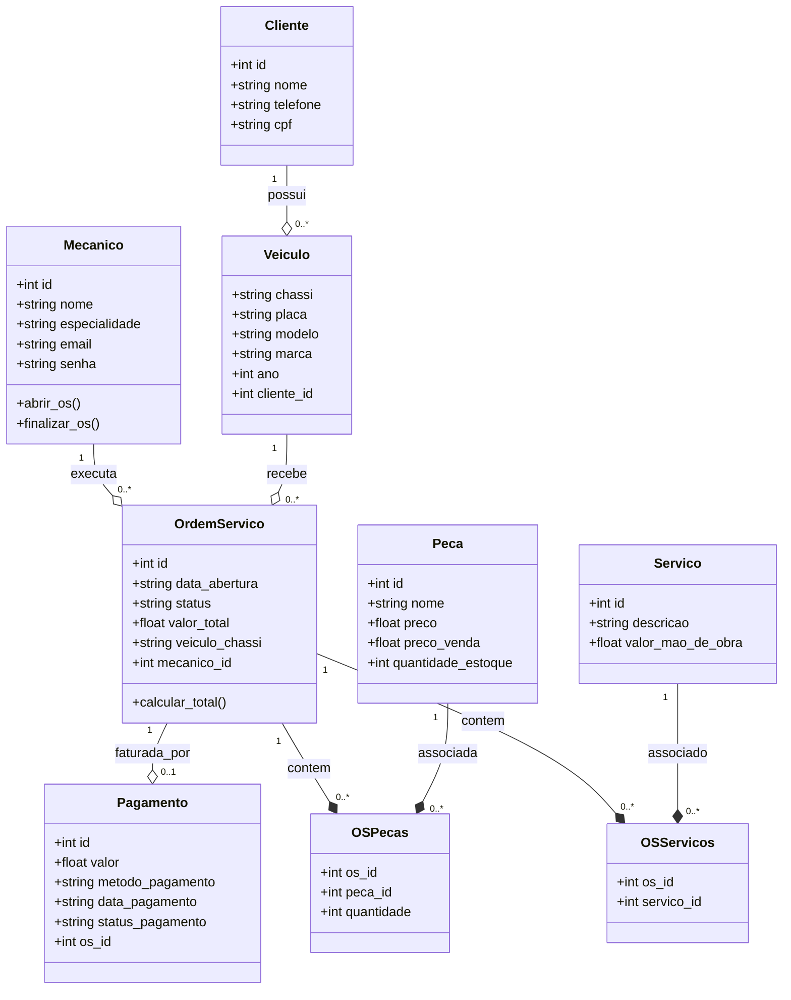

# 📊 Atividade 01 – Modelagem Inicial do Banco de Dados (VibeMecanic)

Este documento apresenta a especificação e modelagem completa de dados do sistema **VibeMecanic**, projetado para a gestão otimizada de oficinas mecânicas. Ele contém a definição de entidades, atributos, relacionamentos com cardinalidades explicadas, regras de negócio refinadas e a validação do banco de dados na Terceira Forma Normal (3FN), atendendo rigorosamente a todos os requisitos solicitados.

---

## 📐 1. Levantamento de Entidades e Atributos

### 📋 Mecanico
* `id` (Código identificador único) — **PK**
* `nome` (Nome completo)
* `especialidade` (Área de atuação do mecânico)
* `email` (E-mail para login)
* `senha` (Senha de acesso)

### 👥 Cliente
* `id` (Código identificador único) — **PK**
* `nome` (Nome completo do cliente)
* `telefone` (Contato telefônico)
* `cpf` (Cadastro de Pessoa Física)

### 🚗 Veiculo
* `chassi` (Código único do chassi do veículo) — **PK**
* `placa` (Placa do veículo)
* `modelo` (Modelo do carro)
* `marca` (Fabricante)
* `ano` (Ano de fabricação)
* `cliente_id` (Chave estrangeira do dono) — **FK**

### 📄 Ordem_Servico
* `id` (Número da ordem de serviço) — **PK**
* `data_abertura` (Data de entrada do veículo)
* `stats` (Status da OS: "Em Aberto", "Em Execução", "Finalizada")
* `valor_total` (Soma automática de peças e mão de obra)
* `veiculo_chassi` (Identificação do veículo atendido) — **FK**
* `mecanico_id` (Identificação do mecânico responsável) — **FK**

### ⚙️ Peca (Catálogo)
* `id` (Código de barras/identificador do item) — **PK**
* `nome` (Nome da peça)
* `preco` (Preço de custo)
* `preco_venda` (Preço cobrado ao cliente)
* `Quantidade_estoque` (Quantidade física em estoque)

### 🛠️ Servico (Catálogo de Mão de Obra)
* `id` (Código do tipo de serviço) — **PK**
* `descricao` (Nome do serviço prestado)
* `valor_mao_obra` (Valor cobrado pela execução do serviço)

### 💳 Pagamento (Fluxo Financeiro)
* `id` (Código identificador do pagamento) — **PK**
* `valor` (Valor total pago)
* `metodo_pagamento` (PIX, Cartão de Crédito, Cartão de Débito, Dinheiro)
* `data_pagamento` (Data da transação)
* `status_pagamento` (Pendente, Aprovado, Cancelado)
* `os_id` (Identificador da OS correspondente) — **FK, UNIQUE**

### 🔗 os_pecas (Tabela Intermediária - Itens da OS)
* `os_id` (Identificador da OS correspondente) — **PK, FK**
* `peca_id` (Identificador da peça utilizada) — **PK, FK**
* `quantidade` (Volume utilizado daquela peça)

### 🔗 os_servicos (Tabela Intermediária - Serviços da OS)
* `os_id` (Identificador da OS correspondente) — **PK, FK**
* `servico_id` (Identificador do serviço prestado) — **PK, FK**

---

## 🔑 2. Definição das Chaves e Relacionamentos

* **Cliente possui Veiculo:**
    * **PK:** `cliente.id`
    * **FK:** `veiculo.cliente_id` (aponta para `cliente.id`)
* **Mecanico executa Ordem_Servico:**
    * **PK:** `mecanico.id`
    * **FK:** `Ordem_Servico.mecanico_id` (aponta para `mecanico.id`)
* **Veiculo recebe Ordem_Servico:**
    * **PK:** `veiculo.chassi`
    * **FK:** `Ordem_Servico.veiculo_chassi` (aponta para `veiculo.chassi`)
* **Ordem_Servico possui Pagamento:**
    * **PK:** `pagamento.id`
    * **FK:** `pagamento.os_id` (aponta para `Ordem_Servico.id` - Relação 1:1 garantida pela restrição UNIQUE)
* **Ordem_Servico utiliza Peca (via `os_pecas`):**
    * **FK 1:** `os_pecas.os_id` (aponta para `Ordem_Servico.id`)
    * **FK 2:** `os_pecas.peca_id` (aponta para `peca.id`)
* **Ordem_Servico contém Servico (via `os_servicos`):**
    * **FK 1:** `os_servicos.os_id` (aponta para `Ordem_Servico.id`)
    * **FK 2:** `os_servicos.servico_id` (aponta para `servico.id`)

---

## 📊 3. Cardinalidades e Justificativas

* **Cliente (1) ➔ (0..N) Veiculo:**
    * *Justificativa:* Um cliente pode cadastrar nenhum ou múltiplos veículos na oficina, mas cada veículo cadastrado pertence obrigatoriamente a apenas um cliente.
* **Mecanico (1) ➔ (0..N) Ordem_Servico:**
    * *Justificativa:* Um mecânico pode ser responsável por várias Ordens de Serviço ao longo do tempo. Uma OS específica possui um único mecânico responsável pela execução técnica.
* **Veiculo (1) ➔ (0..N) Ordem_Servico:**
    * *Justificativa:* Um veículo pode dar entrada e registrar várias Ordens de Serviço históricas na oficina. Uma OS pertence a apenas um veículo de cada vez.
* **Ordem_Servico (1) ➔ (0..1) Pagamento:**
    * *Justificativa:* Uma Ordem de Serviço pode ter no máximo um pagamento associado (relação 1:1). O pagamento pode não existir inicialmente (enquanto a OS estiver "Em Aberto"), mas ao ser finalizada, gera exatamente um registro de pagamento.
* **Ordem_Servico (1) ➔ (0..N) Peca (Através de `os_pecas`):**
    * *Justificativa:* Uma ordem de serviço pode demandar várias peças diferentes para a conclusão do reparo. Uma determinada peça do estoque pode ser aplicada em diferentes Ordens de Serviço históricas. *(Relacionamento N:M desmembrado)*.
* **Ordem_Servico (1) ➔ (0..N) Servico (Através de `os_servicos`):**
    * *Justificativa:* Uma ordem de serviço pode agrupar vários serviços de reparo (ex: balanceamento e troca de óleo). Um serviço tabelado pode ser aplicado em várias Ordens de Serviço. *(Relacionamento N:M desmembrado)*.

---

## 🛡️ 4. Regras de Negócio (RN)

1. **RN01 - Vínculo de Propriedade:** Um veículo não pode ser cadastrado no sistema sem estar formalmente associado a um cliente existente.
2. **RN02 - Cálculo Automatizado:** O `valor_total` de uma Ordem de Serviço deve ser calculado de forma automática pelo sistema com base na soma de: `(quantidade_de_pecas * preco_venda)` + `valor_mao_obra` dos serviços inclusos.
3. **RN03 - Integridade de Histórico:** Peças e Serviços associados a ordens de serviço já finalizadas não podem ser excluídos do catálogo para garantir a consistência do caixa e dos relatórios financeiros.
4. **RN04 - Exclusão de Clientes:** Se o cadastro de um cliente for removido, todos os veículos associados a ele serão deletados em cascata (`ON DELETE CASCADE`). No entanto, as Ordens de Serviço e os registros de Pagamento não devem ser deletados para fins de auditoria interna, tendo as informações do mecânico protegidas (`ON DELETE SET NULL`).

---

## 📐 5. Diagrama de Classes UML (Renderizável via Mermaid no GitHub)



---

## 🗄️ 6. Script DDL (MySQL) para Criação do Banco

Use o script SQL completo abaixo para estruturar o seu banco no MySQL Workbench:

```sql
-- Criação do banco de dados
CREATE DATABASE IF NOT EXISTS Oficina;
USE Oficina;

-- Tabela: Mecânico
CREATE TABLE IF NOT EXISTS mecanico(
    id INT PRIMARY KEY AUTO_INCREMENT,
    nome VARCHAR(50) NOT NULL,
    especialidade VARCHAR(50),
    email VARCHAR(50) UNIQUE NOT NULL,
    senha VARCHAR(15) NOT NULL
);

-- Tabela: Cliente
CREATE TABLE IF NOT EXISTS cliente(
    id INT PRIMARY KEY AUTO_INCREMENT,
    nome VARCHAR(50) NOT NULL,
    telefone VARCHAR(50),
    cpf VARCHAR(30) UNIQUE
);

-- Tabela: Veículo
CREATE TABLE IF NOT EXISTS veiculo(
    chassi VARCHAR(50) PRIMARY KEY,
    placa VARCHAR(50) NOT NULL,
    modelo VARCHAR(50),
    marca VARCHAR(50),
    ano INT,
    cliente_id INT,
    CONSTRAINT fk_veiculo_cliente
        FOREIGN KEY (cliente_id)
        REFERENCES cliente(id)
        ON DELETE CASCADE
);

-- Tabela: Ordem de Serviço (OS)
CREATE TABLE IF NOT EXISTS Ordem_Servico(
    id INT PRIMARY KEY AUTO_INCREMENT,
    data_abertura VARCHAR(10) NOT NULL,
    stats VARCHAR(50) NOT NULL,
    valor_total FLOAT DEFAULT 0.0,
    veiculo_chassi VARCHAR(50),
    mecanico_id INT,
    CONSTRAINT fk_os_veiculo
        FOREIGN KEY (veiculo_chassi)
        REFERENCES veiculo(chassi)
        ON DELETE CASCADE,
    CONSTRAINT fk_os_mecanico
        FOREIGN KEY (mecanico_id)
        REFERENCES mecanico(id)
        ON DELETE SET NULL
);

-- Tabela: Pagamento (Fluxo Financeiro da OS - Relação 1:1)
CREATE TABLE IF NOT EXISTS pagamento(
    id INT PRIMARY KEY AUTO_INCREMENT,
    valor FLOAT NOT NULL,
    metodo_pagamento VARCHAR(50) NOT NULL, -- Ex: PIX, Cartão de Crédito, Dinheiro
    data_pagamento VARCHAR(10) NOT NULL,
    status_pagamento VARCHAR(30) NOT NULL, -- Ex: Pago, Pendente, Cancelado
    os_id INT UNIQUE, -- UNIQUE garante que cada OS tenha no máximo um pagamento
    CONSTRAINT fk_pagamento_os
        FOREIGN KEY (os_id)
        REFERENCES Ordem_Servico(id)
        ON DELETE CASCADE
);

-- Tabela: Peça (Catálogo Geral)
CREATE TABLE IF NOT EXISTS peca(
    id INT PRIMARY KEY AUTO_INCREMENT,
    nome VARCHAR(250) NOT NULL,
    preco FLOAT NOT NULL,
    preco_venda FLOAT NOT NULL,
    Quantidade_estoque INT DEFAULT 0
);

-- Tabela: Serviço (Catálogo Geral)
CREATE TABLE IF NOT EXISTS servico(
    id INT PRIMARY KEY AUTO_INCREMENT,
    descricao VARCHAR(255) NOT NULL,
    valor_mao_obra FLOAT NOT NULL
);

-- TABELA INTERMEDIÁRIA: Peças utilizadas em cada Ordem de Serviço (N:M)
CREATE TABLE IF NOT EXISTS os_pecas(
    os_id INT,
    peca_id INT,
    quantidade INT NOT NULL DEFAULT 1,
    PRIMARY KEY (os_id, peca_id),
    CONSTRAINT fk_os_pecas_os 
        FOREIGN KEY (os_id) 
        REFERENCES Ordem_Servico(id) 
        ON DELETE CASCADE,
    CONSTRAINT fk_os_pecas_peca 
        FOREIGN KEY (peca_id) 
        REFERENCES peca(id) 
        ON DELETE RESTRICT
);

-- TABELA INTERMEDIÁRIA: Serviços prestados em cada Ordem de Serviço (N:M)
CREATE TABLE IF NOT EXISTS os_servicos(
    os_id INT,
    servico_id INT,
    PRIMARY KEY (os_id, servico_id),
    CONSTRAINT fk_os_servicos_os 
        FOREIGN KEY (os_id) 
        REFERENCES Ordem_Servico(id) 
        ON DELETE CASCADE,
    CONSTRAINT fk_os_servicos_servico 
        FOREIGN KEY (servico_id) 
        REFERENCES servico(id) 
        ON DELETE RESTRICT
);
```

---

## 🔍 7. Validação da Modelagem (Revisão das 3 Formas Normais)

* **Primeira Forma Normal (1FN):** Todos os atributos são atômicos (valores indivisíveis). Não existem campos multivalorados compostos.
* **Segunda Forma Normal (2FN):** O banco de dados está na 1FN e todas as colunas que não pertencem à chave primária dependem integralmente da chave primária (sem dependências parciais).
* **Terceira Forma Normal (3FN):** Não há dependências transitivas. Todos os atributos dependem diretamente e exclusivamente das chaves primárias das suas respectivas tabelas. A criação das tabelas intermediárias (`os_pecas` e `os_servicos`) e do isolamento do `pagamento` resolveu de forma definitiva qualquer potencial redundância de relação.
