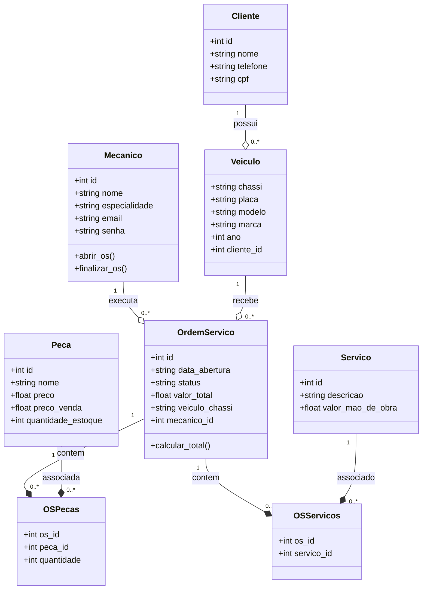

# 📊 Diagrama de Classes UML & Modelagem Física - VibeMecanic

Este documento apresenta a estrutura de dados, tipos de atributos, relacionamentos e o script de criação do banco de dados relacional do **VibeMecanic**, agora totalmente normalizado utilizando tabelas intermediárias para associar peças e serviços às Ordens de Serviço.

---

## 📐 Diagrama de Classes (UML)

O diagrama abaixo representa as classes do sistema, seus atributos, métodos e as relações. Note que a relação entre `OrdemServico` e `Peca`/`Servico` é feita através das classes associativas (tabelas intermediárias):



---

## 🗄️ Script DDL (MySQL) para Criação do Banco

Utilize o script SQL abaixo para criar o banco de dados diretamente no MySQL Workbench. Ele já contém as tabelas intermediárias necessárias para evitar redundâncias e campos nulos.

```sql
-- Criação do banco de dados
CREATE DATABASE IF NOT EXISTS Oficina;
USE Oficina;

-- Tabela: Mecânico
CREATE TABLE IF NOT EXISTS mecanico(
    id INT PRIMARY KEY AUTO_INCREMENT,
    nome VARCHAR(50) NOT NULL,
    especialidade VARCHAR(50),
    email VARCHAR(50) UNIQUE NOT NULL,
    senha VARCHAR(15) NOT NULL
);

-- Tabela: Cliente
CREATE TABLE IF NOT EXISTS cliente(
    id INT PRIMARY KEY AUTO_INCREMENT,
    nome VARCHAR(50) NOT NULL,
    telefone VARCHAR(50),
    cpf VARCHAR(30) UNIQUE
);

-- Tabela: Veículo
CREATE TABLE IF NOT EXISTS veiculo(
    chassi VARCHAR(50) PRIMARY KEY,
    placa VARCHAR(50) NOT NULL,
    modelo VARCHAR(50),
    marca VARCHAR(50),
    ano INT,
    cliente_id INT,
    CONSTRAINT fk_veiculo_cliente
        FOREIGN KEY (cliente_id)
        REFERENCES cliente(id)
        ON DELETE CASCADE
);

-- Tabela: Ordem de Serviço (OS)
CREATE TABLE IF NOT EXISTS Ordem_Servico(
    id INT PRIMARY KEY AUTO_INCREMENT,
    data_abertura VARCHAR(10) NOT NULL,
    stats VARCHAR(50) NOT NULL,
    valor_total FLOAT DEFAULT 0.0,
    veiculo_chassi VARCHAR(50),
    mecanico_id INT,
    CONSTRAINT fk_os_veiculo
        FOREIGN KEY (veiculo_chassi)
        REFERENCES veiculo(chassi)
        ON DELETE CASCADE,
    CONSTRAINT fk_os_mecanico
        FOREIGN KEY (mecanico_id)
        REFERENCES mecanico(id)
        ON DELETE SET NULL
);

-- Tabela: Peça (Catálogo Geral)
CREATE TABLE IF NOT EXISTS peca(
    id INT PRIMARY KEY AUTO_INCREMENT,
    nome VARCHAR(250) NOT NULL,
    preco FLOAT NOT NULL,
    preco_venda FLOAT NOT NULL,
    Quantidade_estoque INT DEFAULT 0
);

-- Tabela: Serviço (Catálogo Geral)
CREATE TABLE IF NOT EXISTS servico(
    id INT PRIMARY KEY AUTO_INCREMENT,
    descricao VARCHAR(255) NOT NULL,
    valor_mao_obra FLOAT NOT NULL
);

-- TABELA INTERMEDIÁRIA: Peças utilizadas em cada Ordem de Serviço (N:M)
CREATE TABLE IF NOT EXISTS os_pecas(
    os_id INT,
    peca_id INT,
    quantidade INT NOT NULL DEFAULT 1,
    PRIMARY KEY (os_id, peca_id),
    CONSTRAINT fk_os_pecas_os 
        FOREIGN KEY (os_id) 
        REFERENCES Ordem_Servico(id) 
        ON DELETE CASCADE,
    CONSTRAINT fk_os_pecas_peca 
        FOREIGN KEY (peca_id) 
        REFERENCES peca(id) 
        ON DELETE RESTRICT
);

-- TABELA INTERMEDIÁRIA: Serviços prestados em cada Ordem de Serviço (N:M)
CREATE TABLE IF NOT EXISTS os_servicos(
    os_id INT,
    servico_id INT,
    PRIMARY KEY (os_id, servico_id),
    CONSTRAINT fk_os_servicos_os 
        FOREIGN KEY (os_id) 
        REFERENCES Ordem_Servico(id) 
        ON DELETE CASCADE,
    CONSTRAINT fk_os_servicos_servico 
        FOREIGN KEY (servico_id) 
        REFERENCES servico(id) 
        ON DELETE RESTRICT
);
```

---

### 📝 Diferenciais Técnicos desta Modelagem (Ponto Forte do Trabalho):

1. **Estrutura sem Limitações:** Com as tabelas intermediárias `os_pecas` e `os_servicos`, o sistema agora permite que uma única Ordem de Serviço registre **múltiplas peças** (ex: 4 velas de ignição, 1 filtro de óleo) e **múltiplos serviços** (ex: troca de óleo e alinhamento) simultaneamente de forma limpa.
2. **Normalização Total (3FN):** O catálogo de peças e de serviços fica isolado. Se o preço de custo de uma peça mudar no catálogo geral, as Ordens de Serviço antigas não sofrem alterações indevidas, garantindo a consistência histórica do caixa da oficina.
3. **Integridade de Deleção com `ON DELETE RESTRICT`:** Uma peça ou serviço cadastrado não pode ser excluído do sistema se já estiver associado a alguma Ordem de Serviço realizada no passado, protegendo a integridade dos relatórios financeiros da oficina.
