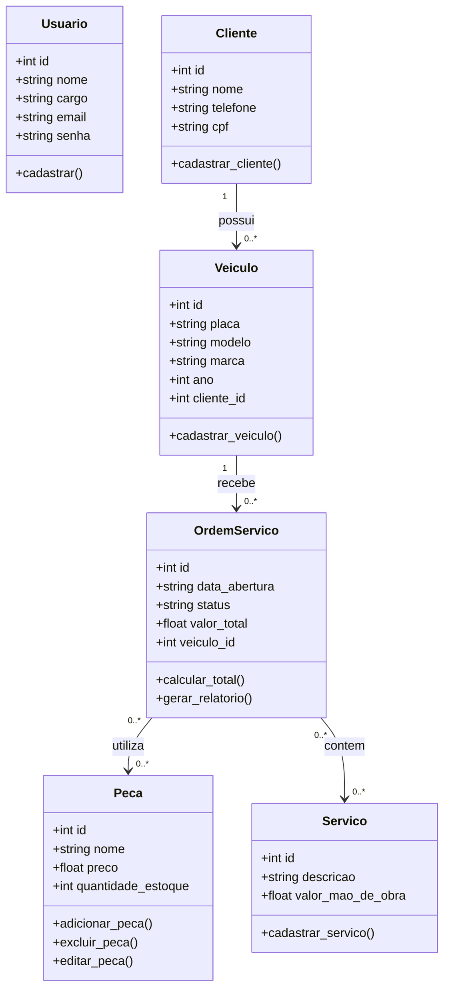

```mermaid
classDiagram
    class Usuario {
        +int id
        +string nome
        +string cargo
        +string email
        +string senha
        +cadastrar()
    }

    class Cliente {
        +int id
        +string nome
        +string telefone
        +string cpf
        +cadastrar_cliente()
    }

    class Veiculo {
        +int id
        +string placa
        +string modelo
        +string marca
        +int ano
        +int cliente_id
        +cadastrar_veiculo()
    }

    class Peca {
        +int id
        +string nome
        +float preco
        +int quantidade_estoque
        +adicionar_peca()
        +excluir_peca()
        +editar_peca()
    }

    class Servico {
        +int id
        +string descricao
        +float valor_mao_de_obra
        +cadastrar_servico()
    }

    class OrdemServico {
        +int id
        +string data_abertura
        +string status
        +float valor_total
        +int veiculo_id
        +calcular_total()
        +gerar_relatorio()
    }

    %% Relacionamentos (Cardinalidades)
    Cliente "1" --> "0..*" Veiculo : possui
    Veiculo "1" --> "0..*" OrdemServico : recebe
    OrdemServico "0..*" --> "0..*" Peca : utiliza
    OrdemServico "0..*" --> "0..*" Servico : contem
```
